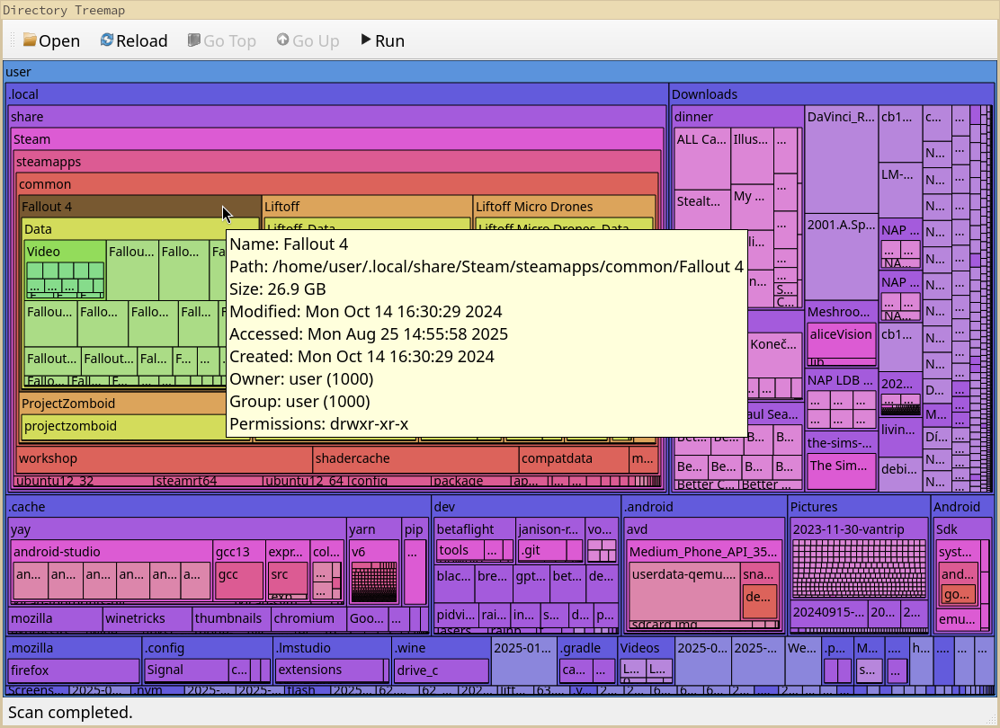

# spcmngrng — directory treemap viewer (SpaceMonger-style)

`spcmngrng` is a fast, no-nonsense treemap viewer for disk usage inspection.  
It recursively scans a directory and draws a squarified treemap where each rectangle’s area is proportional to file size. Navigation is zoom-based, with a toolbar for common actions and rich tooltips for metadata.

> **Python / Qt**: Python 3.9+ and PyQt5.

---

## Screenshot



*(The screenshot in this repo shows a scan of `~/.local/share/Steam/` with hover tooltip.)*

---

## Features

- **Treemap layout**: squarified rectangles sized by file size; directories render sub-treemaps.
- **Responsive UI**: background thread scan; “Open” turns into **Stop** while scanning.
- **Navigation**: **Go Top**, **Go Up**, double-click folders to zoom in their label bands.
- **Selection & Run**: click to select; **Run** opens the file (or folder in your file manager).
- **Tooltips**: full path, human-readable size, mtime/atime/ctime, owner, group, permissions.
- **Color semantics**: stable hues derived from path; zooming keeps the folder’s hue as base.
- **Status bar**: shows scan progress with the currently processed path.
- **Safety guards**: skips volatile or special trees by default (`/proc`, `/sys`, `/dev`, `/run`, `/mnt`).

---

## Install

```bash
# 1) Create/activate a virtualenv (recommended)
python3 -m venv .venv
. .venv/bin/activate

# 2) Install dependencies
pip install PyQt5
```

> If your distro packages PyQt5 separately, you can also use your package manager (e.g., `sudo pacman -S python-pyqt5`, `apt install python3-pyqt5`).

---

## Run

```bash
python spcmngrng.py [START_DIRECTORY]
```

- With no argument, the app opens and prompts you to **Open** a directory.
- With a directory argument, it starts scanning immediately.

---

## Usage & Controls

**Toolbar (left icon + right text):**
- **Open / Stop** — choose a directory to scan; turns into **Stop** while scanning.
- **Reload** — rescan the originally loaded directory.
- **Go Top** — jump to the scan root.
- **Go Up** — go to parent of the current zoom.
- **Run** — open selected file in its associated program (or open folder in file manager).

**Mouse:**
- **Hover** — show tooltip with metadata.
- **Click** — select/deselect a block (selected block dims slightly).
- **Double-click a folder’s *label area*** — zoom into that folder.

**Notes on labels/layout:**
- Each block has a 1px border, 2px padding, a single-line label, optional spacing, and a “sub-viewport” for children. As space shrinks, the sub-viewport collapses before the label.

---

## Performance considerations

- The scan uses `os.scandir` with `lstat`, runs in a worker thread, and aggregates sizes bottom-up.
- For very large directories, children are sorted by size and the widget renders up to 2,000 children directly; the remainder is compacted into an “others” rectangle to keep the UI responsive.

---

## Exclusions & permissions

By default, the scan **ignores**: `/proc`, `/sys`, `/dev`, `/run`, `/mnt` (and their subpaths).  
Edit `EXCLUDED_DIRS` near the top of the file if you need different behavior.

Symbolic links are not followed; `lstat` is used to avoid cycles and surprises.

---

## Packaging a standalone binary (optional)

Use PyInstaller:

```bash
pip install pyinstaller
pyinstaller --noconfirm --onefile --windowed --name spcmngrng spcmngrng.py
```

Artifacts appear in `dist/spcmngrng`. On Linux you may prefer `--onedir` for easier debugging.

---

## Code guide

- **`Node`** — in-memory tree (path, size, children, stat info, hue).
- **`scan_directory`** — recursive scanner with cancellation and status callbacks.
- **`squarify`** — squarified treemap layout (balanced aspect ratios).
- **`TreemapWidget`** — painting, hit-testing, zoom model, selection.
- **`MainWindow`** — toolbar, status bar, threading; wires signals/slots.

---

## Roadmap / Ideas

- Toggle follow-symlinks.
- Filter by name/size/mtime; highlight recent changes.
- Export CSV/JSON of the scan tree.
- Theming and accessibility tweaks (fonts, contrast).
- Context menu (delete, reveal in file manager).

---

## License

MIT

---

## Acknowledgments

- Inspired by SpaceMonger and the squarified treemap algorithm (Bruls, Huizing, van Wijk).
